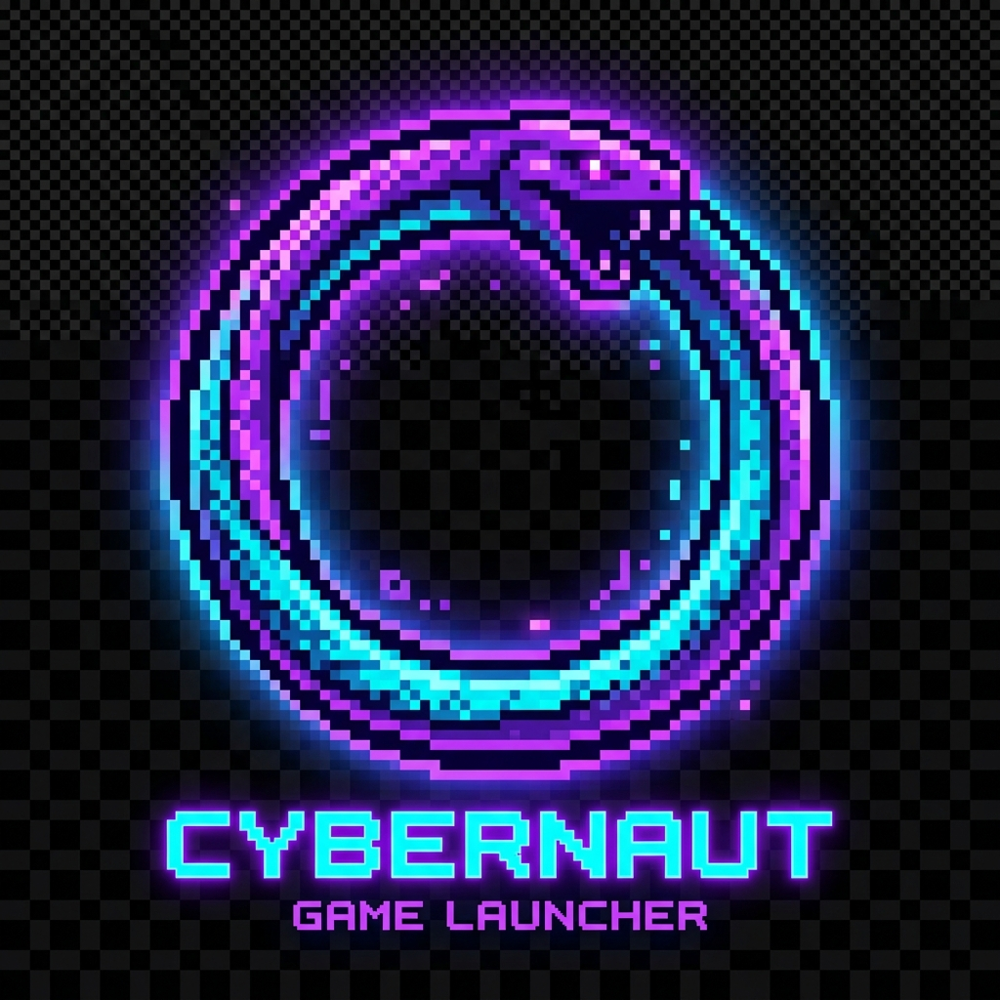

# ═══════════════════════════════════════════════════════════════
#  🎮  Gaming Python — README
# ═══════════════════════════════════════════════════════════════

<p align="center">
  
  <h1 align="center">🎮 Gaming Python</h1>
  <p align="center">Un launcher de jeux vidéo rétro en Python, avec API FastAPI et leaderboard.</p>
</p>

---

## 🕹️ Jeux disponibles

| Jeu | Description |
|-----|-------------|
| 🐍 **Snake** | Classique — mangez, grandissez, survivez ! |
| 🧱 **Tetris** | Empillez les blocs, effacez les lignes ! |
| 🏓 **Pong** | 1 joueur contre l'IA |

---

## 🗂️ Structure du projet

```
Gaming python/
├── client/          # Application Pygame (menu + jeux)
│   ├── main.py      # Point d'entrée
│   ├── menu/        # Menus (principal, scores, réglages)
│   ├── games/       # Un dossier par jeu
│   ├── core/        # Settings, API client, audio
│   └── assets/      # Images, fonts, sons
├── server/          # Backend FastAPI
│   ├── main.py      # API REST
│   ├── api/         # Routes FastAPI
│   ├── models/      # ORM SQLAlchemy
│   ├── schemas/     # Schémas Pydantic
│   └── db/          # Base de données SQLite
├── scripts/         # Lanceurs .bat
├── tests/           # Tests unitaires
├── .env             # Variables d'environnement
└── requirements.txt
```

---

## 🚀 Installation

### 1. Cloner le projet
```bash
git clone https://github.com/votre-user/gaming-python.git
cd "gaming-python"
```

### 2. Créer l'environnement virtuel
```bash
python -m venv venv
venv\Scripts\activate
pip install -r requirements.txt
```

### 3. Configurer l'environnement
```bash
copy .env.example .env
# Modifier .env si besoin
```

---

## ▶️ Lancement

### Option 1 — Script tout-en-un
```bash
scripts\start_all.bat
```

### Option 2 — Manuel
```bash
# Terminal 1 : Serveur API
uvicorn server.main:app --reload --host 0.0.0.0 --port 8000

# Terminal 2 : Menu Pygame
python client/main.py
```

---

## 🌐 API

| Route | Méthode | Description |
|-------|---------|-------------|
| `/api/players/` | `POST` | Créer un joueur |
| `/api/players/{id}` | `GET` | Profil joueur |
| `/api/scores/` | `POST` | Enregistrer un score |
| `/api/leaderboard/{game}` | `GET` | Top 10 d'un jeu |
| `/api/games/` | `GET` | Liste des jeux |
| `/docs` | `GET` | Swagger UI |

---

## 🛠️ Tech Stack

- **Pygame 2** — Rendu graphique et menu
- **FastAPI** — API REST moderne
- **SQLAlchemy** — ORM base de données
- **SQLite** — BDD locale (upgradeable PostgreSQL)
- **httpx** — Client HTTP async

---

## 📄 Licence

MIT — Baptiste © 2024
